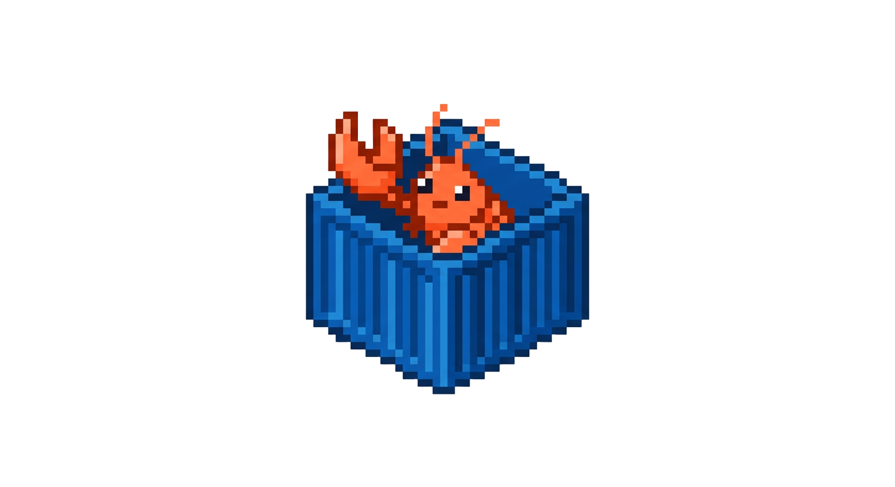

# openclaw-spawn

Run multiple [OpenClaw](https://openclaw.ai) AI agents in isolated Docker containers — each with its own browser, workspace, and gateway.

<p align="center">
  
</p>

<p align="center">
  <a href="https://www.npmjs.com/package/openclaw-spawn"></a>
  <a href="https://github.com/ostapagon/openclaw-spawn/stargazers"></a>
  <a href="https://www.npmjs.com/package/openclaw-spawn"></a>
  <a href="LICENSE"></a>
</p>

```bash
npm install -g openclaw-spawn
openclaw-spawn init
```

> Requires Node.js 18+. Works on macOS, Linux, and Windows.

---

## What it does

[OpenClaw](https://openclaw.ai) is a personal AI assistant that runs on your own machine. `openclaw-spawn` lets you run many OpenClaw instances in parallel — each isolated in its own Docker container with Chromium, VNC browser view, and its own config.

```
┌─────────────────────────────────────────┐
│  openclaw-spawn                         │
│  routes commands · manages instances    │
└──────────┬──────────────┬───────────────┘
           │              │
     ┌─────▼──────┐ ┌─────▼──────┐
     │  agent-1   │ │  agent-2   │
     │  OpenClaw  │ │  OpenClaw  │
     │  Chromium  │ │  Chromium  │
     │  :18789    │ │  :19001    │
     └────────────┘ └────────────┘
```

---

## Getting started

```bash
npm install -g openclaw-spawn
openclaw-spawn init
```

`init` handles everything:
- Installs Docker if missing (macOS: Homebrew, Linux: apt/dnf/yum/pacman, Windows: winget)
- Builds the base Docker image
- Runs the OpenClaw onboarding wizard (API key, model, channels)
- Starts the gateway with browser support ready

After init:

```bash
openclaw-spawn tui        # chat with your agent
openclaw-spawn browser    # open VNC tab to see/control the browser
openclaw-spawn dashboard  # open the web control panel
```

---

## Multiple instances

```bash
openclaw-spawn onboard    # add another instance
openclaw-spawn list       # see all instances with status
```

---

## All commands

**Setup**
```bash
openclaw-spawn init               # first-time setup wizard
openclaw-spawn build              # rebuild Docker base image
```

**OpenClaw** (auto-selects instance)
```bash
openclaw-spawn onboard            # run onboarding wizard
openclaw-spawn gateway [-d]       # start gateway (-d for background)
openclaw-spawn tui                # open TUI
openclaw-spawn dashboard          # open web dashboard
openclaw-spawn channels status    # check channels
```

**Browser**
```bash
openclaw-spawn browser            # open VNC view of agent's browser
openclaw-spawn browser stop       # close VNC (agent browser keeps running)
```

**Management**
```bash
openclaw-spawn list               # list all instances
openclaw-spawn start <name>       # start instance
openclaw-spawn stop <name>        # stop instance
openclaw-spawn remove <name>      # remove instance
openclaw-spawn logs <name> [-f]   # view logs
openclaw-spawn cleanup            # remove all containers and reset
```

---

## Ports (per instance)

| Offset | Service |
|--------|---------|
| +0 | Gateway / dashboard |
| +11 | Chrome CDP |
| +20 | noVNC browser view |

---

## Data

- Metadata: `~/.openclaw-spawn/instances.json`
- Instance config & workspace: `~/.openclaw-spawn/instances/<name>/`

---

## Accessing the dashboard

1. Open the dashboard:
   ```bash
   openclaw-spawn dashboard
   ```
   This prints a URL like `http://localhost:18789/#token=...` and opens it in your browser.

2. First time you open it, the browser will say **"pairing required"**. This is OpenClaw's security model — every new browser/device must be approved once.

3. Approve your browser from the terminal:
   ```bash
   openclaw-spawn devices list           # find your pending device
   openclaw-spawn devices approve <ID>   # approve it
   ```

4. Refresh the browser — you're in.

> Pairing is per-browser, per-instance. You won't need to do it again on the same browser.

---

## Troubleshooting

**Build fails**
```bash
docker rmi openclaw-spawn-base:latest
openclaw-spawn build
```

**Start fresh**
```bash
openclaw-spawn cleanup
```

---

## Development

```bash
git clone https://github.com/ostapagon/openclaw-spawn.git
cd openclaw-spawn
npm install
npm link
```

---

MIT · Built for [OpenClaw](https://openclaw.ai)
